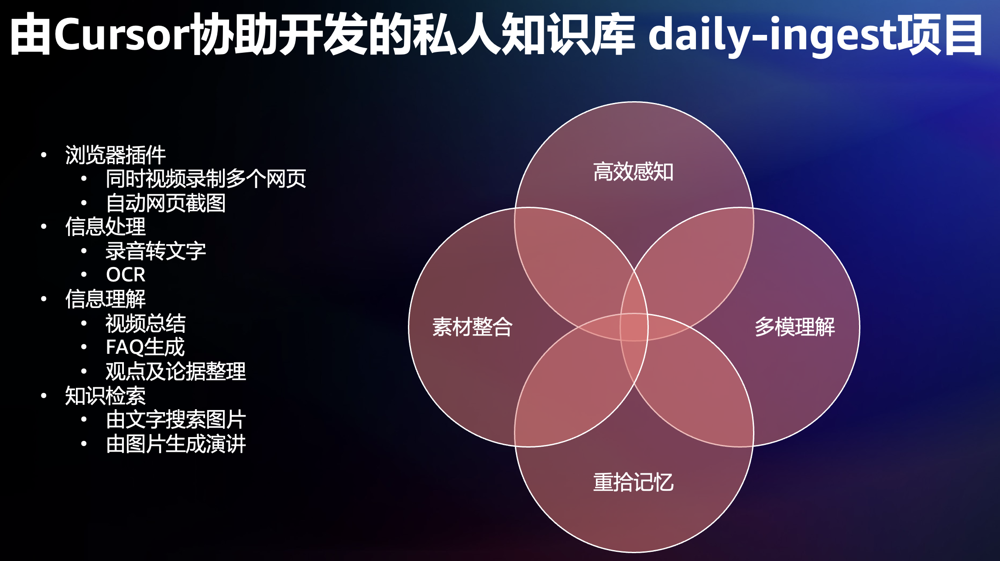
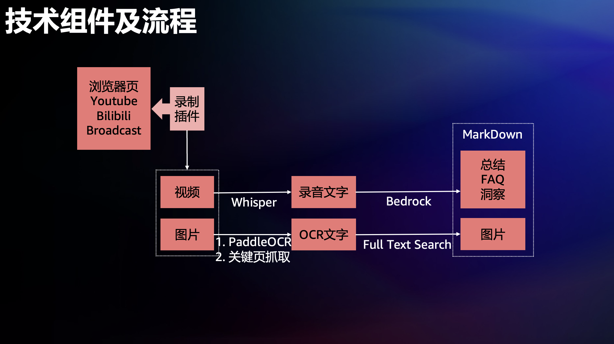

Project Name: timemachine

SubProject Name: tm_daily_ingest

Components:

* fooRound: Chrome extension that can record the browser as a mp4 file toward Downloads folder. Also, by default, it captures screenshot of the current tab every 10 seconds.
* whisperer: Python program that convert a mp4 file into a text file using whisper model.
* ocr: Python program that convert a image file into a text file using PaddleOCR.
* indexer: Python program that accepts a search keyword, search within all OCR recognized text files, and return the HTML file to view locally
* insight-generator: Python program that accepts a folder name under Downloads folder by default, and calls Bedrock to generate Summary, FAQ and Mentioned Insights.

Future Work:

* 目前由Markdown+命令行交互，未来形成统一用户交互界面
* 利用Whisper时间戳功能，进行文字反查字幕视频重放
* Whisper生成录音文字的后期处理，简体繁体没有标点，用大模型形成通稿（output size过小问题）
* 将大部分处理放到服务端
